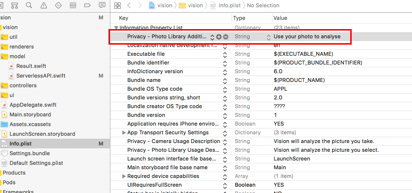

# Vision App - イメージのタグ付けとフェイスディテクションをIBM Cloud(Bluemix)で作成するサンプルiOSアプリケーション

Vision Appは、自動でイメージにタグを付けて顔認識をする、サンプルiOSアプリケーションです。 これらの仕組みは、IBM visual recognitionテクノロジーが使用されています。

写真を撮るか、既存の画像を選択し、アプリケーションでタグのリストを作成し、画像内の人物、建物、オブジェクトを検出します。結果はインターネットで共有できます。

  

## Overview

 IBM Cloud(Bluemix)で作成するこのアプリは以下の機能を使用します:
  * Watson Visual Recognition
  * OpenWhisk
  * Cloudant


<details>
<summary></summary>
vision_analysis
  digraph G {
    node [fontname = "helvetica"]
    /* stores image */
    app -> cloudant
    /* analyzes the image */
    app -> openwhisk
    {rank=same; app -> openwhisk -> watson [style=invis] }
    /* openwhisk reads from cloudant */
    cloudant -> openwhisk
    /* whisk passes image to visual recognition */
    openwhisk -> watson
    /* whisk provides result */
    openwhisk -> app
    /* services on top */
    {rank=source; cloudant }
    /* styling ****/
    cloudant [shape=circle style=filled color="%234E96DB" fontcolor=white label="Cloudant"]
    watson [shape=circle style=filled color="%234E96DB" fontcolor=white label="Watson\nVisual\nRecognition"]
    openwhisk [shape=circle style=filled color="%2324B643" fontcolor=white label="OpenWhisk"]
  }
vision_analysis
</details>

このアプリケーションは、画像をCloudantデータベースに送信します。次に、OpenWhiskアクションを呼び出して画像を分析し、分析結果を返します。

このアプリケーションは、ユースケースの1例です。この例で実装されているOpenWhiskアクションを装備した別のユースケースは、検索機能を向上させるために画像をライブラリに自動的に分類します。同じOpenWhiskアクションですが、別のコンテキストで使用します。実際、このアクションでは、単一のサーバーを展開または管理することなく、クラウド内のイメージ分析用のマイクロサービスを作成しました。

## 事前作業

* IBM Cloud(Bluemix) アカウントの作成。IBM Cloudへ [Sign up][bluemix_signup_url] へサインアップするか、既存のアカウントを利用してください。
* IBM Cloud Functions(OpenWhisk) へのアクセスはこちら [Sign up for Bluemix OpenWhisk](https://console.ng.bluemix.net/openwhisk) から。
* XCode 8.1, iOS 10, Swift 3.0

## 環境の準備

### コードの取得

* このリポジトリをローカル環境へCloneするか、ターミナルから次のコマンドを実行して下さい。

  ```
  git clone https://github.com/IBM-Bluemix/openwhisk-visionapp.git
  ```

* または [this archive](https://github.com/IBM-Bluemix/openwhisk-visionapp/archive/master.zip) から、圧縮したファイルをダウンロードして下さい。

### IBM Cloud (Bluemix) サービス

1. IBM Cloud (Bluemix) コンソールを開きます

1. Cloudant NoSQL DBサービスインスタンスを次の名前で作成します **cloudant-for-vision**

1. Cloudantのダッシュボードを開き、新しいデータベースを次の名前で作成します **openwhisk-vision**

1. Watson Visual Recognitionサービスインスタンスを次の名前で作成します **visualrecognition-for-vision**

***Note***: *もし既にこれらのサービスインスタンスを作成済みでしたら、それらを再利用しても結構です。その場合、Swiftのコードで指定しているサービス名を適宜置き換えて下さい。*

### Cloud Functions (OpenWhisk) Actions

1. 次のコマンドで既存のアクションリストを確認できます。

  ```
  wsk list
  ```

1. 次のコマンドで、新たにアクションを作成します。URLやKeyは適宜自分の環境のものに置き換えて下さい。これらの情報は、IBM Cloud (Bluemix)上の各サービスの資格情報から確認することができます。資格情報が無い場合は新規作成して下さい。

  ```
  wsk action create -p cloudantUrl [URL] -p cloudantDbName openwhisk-vision -p watsonApiKey [123] vision-analysis analysis.js
  ```

### XCodeでの実装

iOSアプリケーションで使用するために、作成したIBM Cloud (Bluemix)の各サービスの情報をSwiftのコード上へ記述します。Cloudantの資格情報、OpenWhiskの名前空間(namespace)とAppKeyが必要になります。

1. **vision.xcworkspace** を、XCodeで開きます

1. **vision/vision/model/ServerlessAPI.swift** を開きます

1. **CloudantUrl** へ、Cloudantサービスの資格情報に記載されているURLを記述します

1. **WhiskAppKey** と **WhiskAppSecret** へ、Cloud Functions (OpenWhisk)の資格情報にある値を記述します
これらの値は、 [iOS SDK configuration page](https://console.ng.bluemix.net/openwhisk/learn/ios-sdk) から取得するか、以下のCLIコマンドで取得することができます

  ```
  wsk property get --auth
  ```

  ```
  whisk auth kkkkkkkk-kkkk-kkkk-kkkk-kkkkkkkkkkkk:tttttttttttttttttttttttttttttttttttttttttttttttttttttttttttttttt
  ```

  コロンの前の文字列がkey、後ろの文字列がsecretです。

1. ファイルを保存します

## アプリケーションのビルド・実行

### With the iOS simulator

1. iOS10以降では、カメラアクセスの目的を設定しないと強制終了します　*info.plist* を設定します

　　Key：NSCameraUsageDescription

　　Description：任意の説明文

  

1. *iPhone 6s* またはそれ以降をターゲットに指定して、Xcodeで実行します

  

1. 既存の写真を選択します

  

  *Note:
  To add pictures to the simulator, go to the home screen (Cmd+Shift+H).
  Drag and drop images from the Finder to the simular window.
  This will open the Photos app and you should see your images.*

1. 写真はIBM Cloud上のVisual Recognition APIへ送られ、解析結果が帰ってきます

  

  Results are made of the faces detected in the picture and of tags
  returned by Watson.
  The tags with the highest confidence score are pre-highlighted.
  The highlighted tags will be used when sharing the picture.
  You can tap tags to toggle their state.

1. Shareボタンを押すと、iOS標準のシェア画面が開きます

  

  *Note:
  to configure a Twitter account, go to the Settings app on the simulator.
  Under Twitter, add your account (no need for the Twitter app to be installed).
  You can go back to the home screen with Cmd+Shift+H*

1. 例えばTwitterを選択します

  

  The picture and the highlighted tags are included in the message.
  The message can be edited before posting.

## Code Structure

### IBM Cloud Functions (OpenWhisk)

[**analysis.js**](analysis.js) holds the JavaScript code to perform the image analysis:

1. It retrieves the image data from the Cloudant document.
The data has been attached by the iOS app as an attachment named "image.jpg".
1. It saves the image file locally.
1. If needed, it resizes the image so that it matches the requirements of the Watson service
1. It calls Watson
1. It returns the results of the analysis

The action runs asynchronously.

### iOS

| File | Description |
| ---- | ----------- |
|[**ServerlessAPI.swift**](vision/vision/model/ServerlessAPI.swift)| Stores the image in Cloudant and executes the *analysis* OpenWhisk action, waiting for the result.|
|[**Result.swift**](vision/vision/model/Result.swift)| Encapsulates the JSON result|
|[**HomeController.swift**](vision/vision/controllers/HomeController.swift)| Manages the selection of an existing picture and taking a picture from the camera|
|[**ResultController.swift**](vision/vision/controllers/ResultController.swift)| Uses **ServerlessAPI** to send the image for processing and then display the results of the analysis|
|[**FacesController.swift**](vision/vision/controllers/FacesController.swift)| Embedded in **ResultController** if handles the face collection view|
|[**FaceCellRenderer.swift**](vision/vision/renderers/FaceCellRenderer.swift)| Renders a face in the **FacesController**|

## Contribute

Please create a pull request with your desired changes.

## Troubleshooting

### OpenWhisk

Polling activations is good start to debug the OpenWhisk action execution. Run
```
wsk activation poll
```
and submit a picture for analysis.

A typical activation log when everything goes fine will look like:
```
Activation: vision-analysis (123fb4230902822202029fff436a94be745)
2016-02-23T16:17:53.955350233Z stdout: [ 49382920fdb022039403934b3bd33d00 ] Processing image.jpg from document
2016-02-23T16:17:59.847872226Z stdout: [ 49382920fdb022039403934b3bd33d00 ] OK
```

### iOS

The application prints several statements to the console as it uploads,
analyzes and updates the user interface.
Make sure you correctly updated the constants in ServerlessAPI.swift.

## Credits

The application uses:

* [Alamofire](https://github.com/Alamofire/Alamofire) ([License](https://github.com/Alamofire/Alamofire/blob/master/LICENSE))
* [AlamofireImage](https://github.com/Alamofire/AlamofireImage) ([License](https://github.com/Alamofire/AlamofireImage/blob/master/LICENSE))
* [SwiftyJSON](https://github.com/SwiftyJSON/SwiftyJSON) ([License](https://github.com/SwiftyJSON/SwiftyJSON/blob/master/LICENSE))
* [TagListView](https://github.com/xhacker/TagListView) ([License](https://github.com/xhacker/TagListView/blob/master/LICENSE))
* [JGProgressHUD](https://github.com/JonasGessner/JGProgressHUD) ([License](https://github.com/JonasGessner/JGProgressHUD/blob/master/LICENSE.txt))
* [RDHCollectionViewGridLayout](https://github.com/rhodgkins/RDHCollectionViewGridLayout) ([License](https://github.com/rhodgkins/RDHCollectionViewGridLayout/blob/master/LICENSE))

[bluemix_signup_url]: https://console.ng.bluemix.net/?cm_mmc=GitHubReadMe

## License

See [License.txt](License.txt) for license information.
