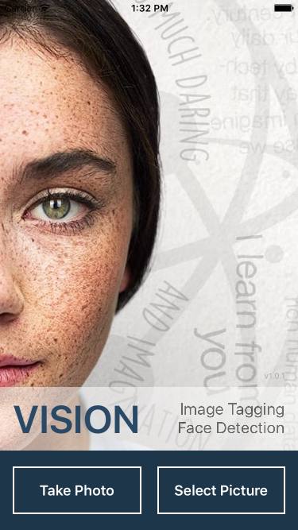
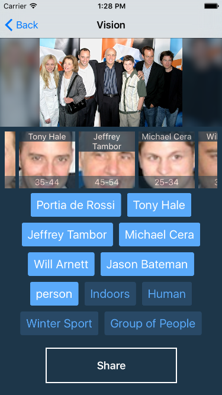
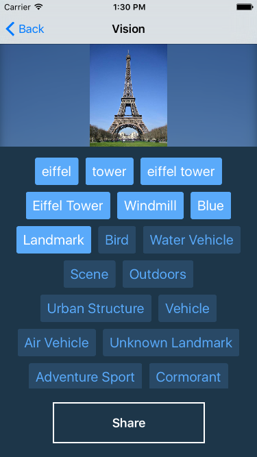
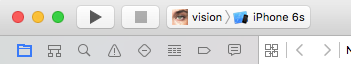
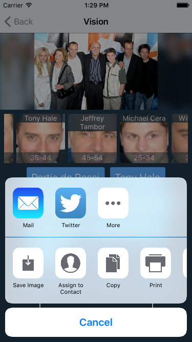
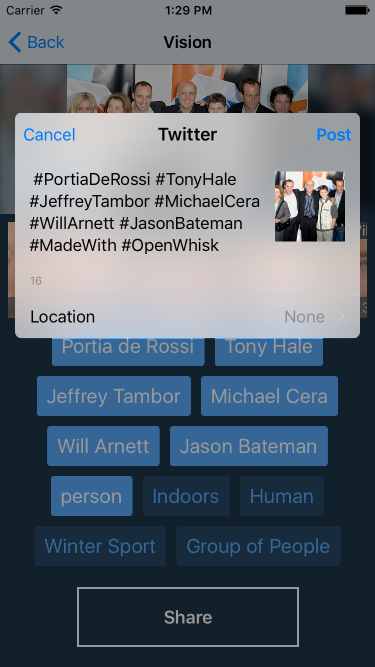

# Vision App - a sample iOS app for image tagging and face detection built with IBM Bluemix OpenWhisk

Vision App is a sample iOS application to automatically tag images and detect faces
by using IBM visual recognition technologies.

Take a photo or select an existing picture, let the application generate a list of tags and detect
people, buildings, objects in the picture. Share the results with your network.

  
  
  

## Overview

 Built using IBM Bluemix, the application uses:
  * Watson Visual Recognition
  * Alchemy Vision
  * OpenWhisk
  * Cloudant


The application sends the picture to a Cloudant database. Then it calls an OpenWhisk action that
will analyze the picture and send back the results of the analysis.

This application is one example use case. Equipped with the OpenWhisk action implemented in this example,
an other use case could be to automatically classify images in a library to improve search capabilities:
the same OpenWhisk action but used in a different context. Indeed with this action, we created a microservice
for image analysis in the cloud, without deploying or managing a single server.

## Application Requirements

* IBM Bluemix account. [Sign up][bluemix_signup_url] for Bluemix, or use an existing account.
* IBM Bluemix OpenWhisk early access. [Sign up for Bluemix OpenWhisk](https://new-console.ng.bluemix.net/openwhisk).
* XCode 7.2

## Preparing the environment

### Get the code

* Clone the app to your local environment from your terminal using the following command:

  ```
  git clone https://github.com/IBM-Bluemix/openwhisk-visionapp.git
  ```

* or Download and extract the source code from [this archive](https://github.com/IBM-Bluemix/openwhisk-visionapp/archive/master.zip)

### Create the Bluemix Services

1. Open the IBM Bluemix console

1. Create a Cloudant NoSQL DB service instance named **cloudant-for-vision**

1. Open the Cloudant service dashboard and create a new database named **openwhisk-vision**

1. Create a Watson Visual Recognition service instance named **visualrecognition-for-vision**

1. Create an Alchemy API service instance named **alchemyapi-for-vision**

***Note***: *if you have existing instances of these services, you don't need to create new instances.
You can simply reuse the existing ones.*

### Deploy OpenWhisk Actions

1. Ensure your OpenWhisk command line interface is property configured with:

  ```
  wsk list
  ```

1. Create the action using the following command line replacing the placeholders with
the credentials obtained from the respective service dashboards in Bluemix:

  ```
  wsk action create -p cloudantUrl [URL] -p cloudantDbName openwhisk-vision -p alchemyKey [123] -p watsonUsername [user] -p watsonPassword [pass] vision-analysis analysis.js
  ```

### Configure XCode

To configure the iOS application, you need the credentials of the Cloudant service created above,
the current OpenWhisk namespace and your OpenWhisk authorization key.

1. Open **vision.xcworkspace** with XCode

1. Open the file **vision/vision/model/ServerlessAPI.swift**

1. Set the value of the constant **CloudantUrl** to the Cloudant service credentials url.

1. Set the value of the constant **ActionNamespace** to the name of the namespace
  where the action was created. You can retrieve the current namespace with:

  ```
  wsk property get --namespace
  ```

1. Set the value of the constants **WhiskAppKey** and **WhiskAppSecret**
to your OpenWhisk credentials. You can retrieve them from the [iOS SDK configuration page](https://new-console.ng.bluemix.net/openwhisk/sdk/ios).
  
1. Save the file

## Running the application

### With the iOS simulator

1. Start the application from XCode with *iPhone 6s* as the target

  

1. Select an existing picture

  

  *Note:
  To add pictures to the simulator, go to the home screen (Cmd+Shift+H).
  Drag and drop images from the Finder to the simular window.
  This will open the Photos app and you should see your images.*

1. The picture is sent for analysis and results are returned:

  
  
  Results are made of the faces detected in the picture and of tags
  returned by Watson and AlchemyAPI.
  The tags with the highest confidence score are pre-highlighted.
  The highlighted tags will be used when sharing the picture.
  You can tap tags to toggle their state.
  
1. Press the Share button. This opens the standard iOS sharing screen.

  
  
  *Note:
  to configure a Twitter account, go to the Settings app on the simulator.
  Under Twitter, add your account (no need for the Twitter app to be installed).
  You can go back to the home screen with Cmd+Shift+H*

1. Pick Twitter as example.

  
  
  The picture and the highlighted tags are included in the message.
  The message can be edited before posting.

## Code Structure

### OpenWhisk

[**analysis.js**](analysis.js) holds the JavaScript code to perform the image analysis:

1. It retrieves the image data from the Cloudant document.
The data has been attached by the iOS app as an attachment named "image.jpg".
1. It saves the image file locally.
1. If needed, it resizes the image so that it matches the requirements of the Watson and Alchemy API
1. It calls Watson and AlchemyAPI in parallel
1. It returns the results of the analysis

The action runs asynchronously.

### iOS

| File | Description |
| ---- | ----------- |
|[**ServerlessAPI.swift**](vision/vision/model/ServerlessAPI.swift)| Stores the image in Cloudant and executes the *analysis* OpenWhisk action, waiting for the result.|
|[**Result.swift**](vision/vision/model/Result.swift)| Encapsulates the JSON result|
|[**HomeController.swift**](vision/vision/controllers/HomeController.swift)| Manages the selection of an existing picture and taking a picture from the camera|
|[**ResultController.swift**](vision/vision/controllers/ResultController.swift)| Uses **ServerlessAPI** to send the image for processing and then display the results of the analysis|
|[**FacesController.swift**](vision/vision/controllers/FacesController.swift)| Embedded in **ResultController** if handles the face collection view|
|[**FaceCellRenderer.swift**](vision/vision/renderers/FaceCellRenderer.swift)| Renders a face in the **FacesController**|

## Contribute

Please create a pull request with your desired changes.

## Troubleshooting

### OpenWhisk

Polling activations is good start to debug the OpenWhisk action execution. Run
```
wsk activation poll
```
and submit a picture for analysis.

A typical activation log when everything goes fine will look like:
```
Activation: vision-analysis (123fb4230902822202029fff436a94be745)
2016-02-23T16:17:53.955350233Z stdout: [ 49382920fdb022039403934b3bd33d00 ] Processing image.jpg from document
2016-02-23T16:17:59.847872226Z stdout: [ 49382920fdb022039403934b3bd33d00 ] OK
```

### iOS

The application prints several statements to the console as it uploads,
analyzes and updates the user interface.
Make sure you correctly updated the constants in ServerlessAPI.swift.

## Credits

The application uses:

* [Alamofire](https://github.com/Alamofire/Alamofire) ([License](https://github.com/Alamofire/Alamofire/blob/master/LICENSE))
* [AlamofireImage](https://github.com/Alamofire/AlamofireImage) ([License](https://github.com/Alamofire/AlamofireImage/blob/master/LICENSE))
* [SwiftyJSON](https://github.com/SwiftyJSON/SwiftyJSON) ([License](https://github.com/SwiftyJSON/SwiftyJSON/blob/master/LICENSE))
* [TagListView](https://github.com/xhacker/TagListView) ([License](https://github.com/xhacker/TagListView/blob/master/LICENSE))
* [JGProgressHUD](https://github.com/JonasGessner/JGProgressHUD) ([License](https://github.com/JonasGessner/JGProgressHUD/blob/master/LICENSE.txt))
* [RDHCollectionViewGridLayout](https://github.com/rhodgkins/RDHCollectionViewGridLayout) ([License](https://github.com/rhodgkins/RDHCollectionViewGridLayout/blob/master/LICENSE))

[bluemix_signup_url]: https://console.ng.bluemix.net/?cm_mmc=GitHubReadMe

## License

See [License.txt](License.txt) for license information.
